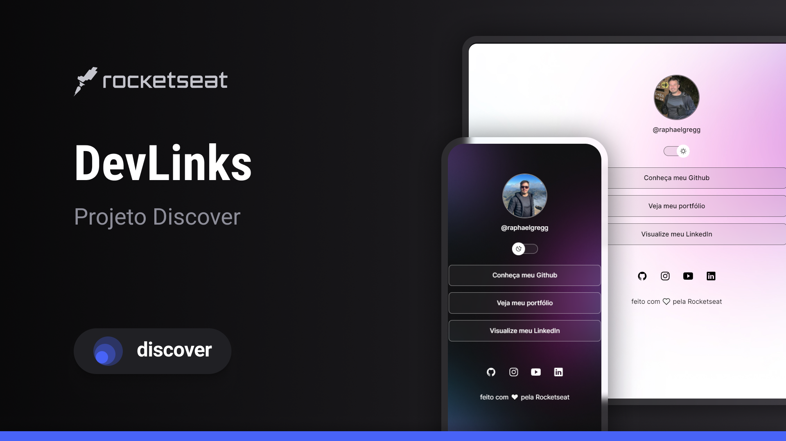

<h1 align="center">
  🚀 Dev Links
</h1>

  

  <a href="#evento">Evento</a>&nbsp;&nbsp;&nbsp;|&nbsp;&nbsp;&nbsp;
  <a href="#rocket-tecnologias">Tecnologias</a>&nbsp;&nbsp;&nbsp;|&nbsp;&nbsp;&nbsp;
  <a href="#-projeto">Projeto</a>&nbsp;&nbsp;&nbsp;|&nbsp;&nbsp;&nbsp;
  <a href="#-layout">Layout</a>&nbsp;&nbsp;&nbsp;|&nbsp;&nbsp;&nbsp;

 

## Evento

Curso organizado pela @Rocketseat, que abordou a construção do projeto Dev Links, na Projeto Discover.

desenvolvida uma aplicação, que agrega links.

Usando o poder do Html, CSS e o JavaScript.

## :rocket: Tecnologias

Esse projeto foi desenvolvido com as seguintes tecnologias:

-  [HTML](https://developer.mozilla.org/pt-BR/docs/Web/HTML)
-  [CSS](https://developer.mozilla.org/pt-BR/docs/Web/CSS)
-  [JavaScript](https://developer.mozilla.org/pt-BR/docs/Web/JavaScript)

## 💻 Projeto

O Dev Links é uma agredador de links que pode simplificar concentrar a busca por informações

## 🔖 Layout

Você pode visualizar o layout do projeto no formato através [desse link](<https://www.figma.com/file/hqNvNLzZuEUyJlG9NyXG13/DevLinks-%E2%80%A2-Projeto-Discover-(Community)?type=design&node-id=0-1&mode=design&t=2tobseWS3u77CdPo-0>). Lembrando que você irá precisar ter uma conta no [Figma](http://figma.com/).

**Instrutor: [Mayk Brito](https://github.com/maykbrito)**
